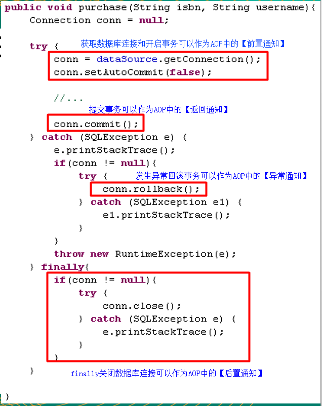

# spring4-test
spring4 test and review

## srping4-test01
spring中通过xml配置文件配置bean。
### character1
hello world入门程序，通过setter方法装配bean
### character2
通过构造器装配bean
### character3
装配bean的List、Map、Properties属性，以及使用util标签和p标签进行配置简化。
### character4
在配置文件的<bean>标签中使用autowire属性进行自动装配，这种方式不常用，不推荐使用。
### character5
bean的继承和依赖
### character6
演示bean的作用域（单例、多例配置）
### character7 
使用property-placeholder将bean的属性配置转移到外部的properties配置文件
### character8 
SpEL表达式的用法
### character9 
bean的生命周期以及使用BeanPostProcessor（bean的后置处理器）使Bean的生命周期更加细粒度
### character10
演示通过配置静态工厂、实例工厂获取工厂返回的实例。
### character11
自定义FactoryBean。

## srping4-test02
spring中通过注解的方式配置bean。
### character1
演示基于注解进行依赖的注入，主要演示使用@Autowired注解进行自动装配。
### character2
演示spring4.0的新特性，泛型依赖注入，这里只是做简单演示，实际应用自行百度。

## spring4-test03
spring的AOP。
### character1 
演示基于AspectJ的AOP功能（spring注解形式），详细解释了5种通知类型，另外讲解了设置切面优先级以及复用切入点表达式。
### character2
演示通过spring的xml配置文件使用AOP。

## spring4-test04
spring的JDBCTemplate演示。
### character1
JdbcTemplate的简单演示
###character2
通过一个案例演示spring中的声明式事务。

spring中对事物管理是通过AOP来完成的，请看下图：

上图是原生的在jdbc中使用事务的方式，其实spring就是通过AOP来切入需要事务的方法中，通过不同的通知类型来控制事务的开启、提交、回滚等。

另外，还演示了事务的五个属性：传播行为、隔离级别、rollbackFor、只读事务（readOnly）、事务超时时间（timeout）

